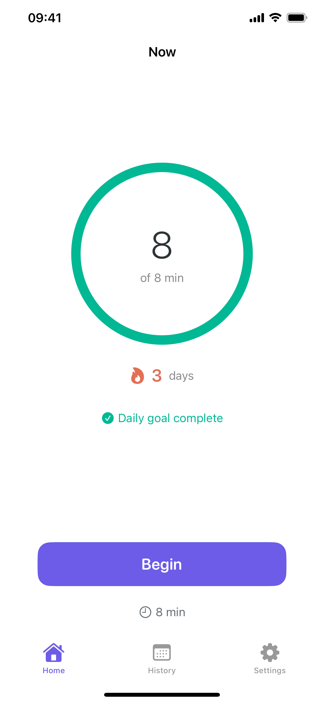
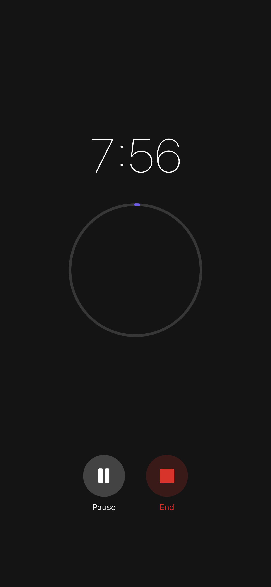
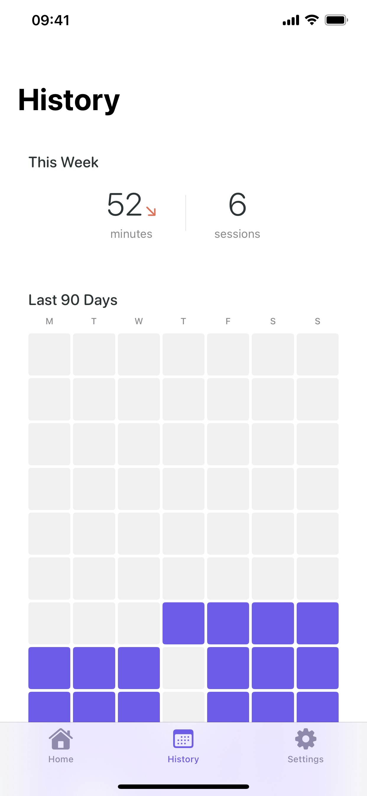
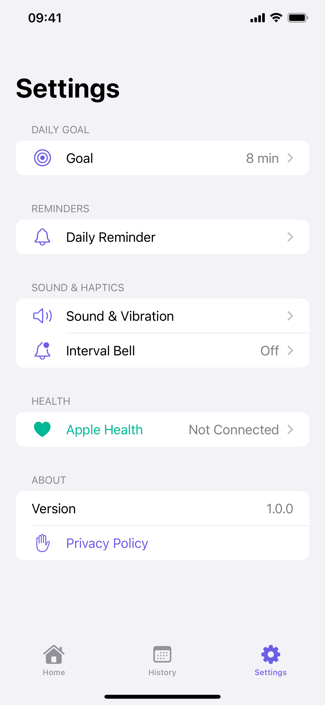

# Now

A minimal meditation timer for iOS and Apple Watch focused on building a consistent daily practice.

<p align="center">
  
  
  
  
</p>

## Features

- **Simple timer** with presets (5, 8, 10, 15, 20, 30 min) or custom durations up to 60 minutes
- **Daily goal tracking** with a visual progress ring (default: 8 minutes)
- **Streak counter** to maintain your meditation habit
- **Session history** with a weekly summary and 90-day heatmap
- **Apple Health** integration for Mindful Minutes
- **Apple Watch** companion app for on-the-go sessions
- **Interval bells** at configurable intervals during sessions
- **Haptic feedback** and sound effects
- **Daily reminders** via local notifications
- **No accounts, no subscriptions, no tracking** — all data stays on your device

## Requirements

- iOS 17.0+
- watchOS 10.0+
- Xcode 15.0+
- Swift 5.9+

## Getting Started

1. Clone the repo:
   ```bash
   git clone https://github.com/briankemler/now.git
   ```
2. Open `Now.xcodeproj` in Xcode
3. Select your development team in Signing & Capabilities
4. Build and run on a simulator or device

## Architecture

The app uses **SwiftUI** and **SwiftData** with an MVVM architecture.

```
Now/
├── App/             # App entry point and root navigation
├── Extensions/      # Color, Date, and TimeInterval helpers
├── Models/          # SwiftData models (MeditationSession, UserGoal, StreakRecord, AppSettings)
├── Services/        # HealthKit, Timer, Sound, Haptics, Notifications, Watch Connectivity
├── ViewModels/      # Home, Timer, History, Settings, Onboarding view models
├── Views/           # SwiftUI views organized by feature
└── Resources/       # Assets, Info.plist, entitlements, privacy manifest

NowWatch/            # Apple Watch companion app
NowWatchWidget/      # Watch complications
NowTests/            # Unit tests
```

## Privacy

Now does not collect any data. All meditation sessions, streaks, and settings are stored locally on your device. See the full [privacy policy](https://briankemler.github.io/now/privacy-policy.html).

## License

All rights reserved.
